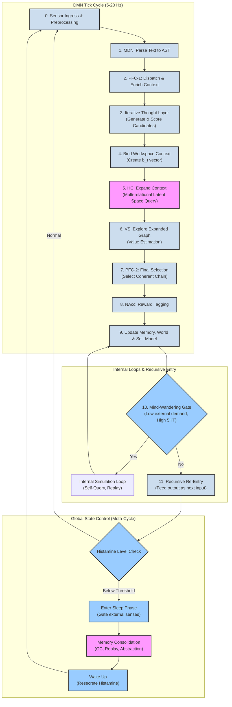

# DMN Algorithm Control Flow Graph

This diagram visualizes the core cognitive loop of the ACI, as detailed in `Algorithm.md`. It illustrates the flow of information from sensory input through various processing stages, culminating in action, memory updates, and recursive re-entry.

### How to Read the Diagram:

1.  **DMN Tick Cycle**: This is the main, high-frequency loop (5-20 Hz) that represents one "thought." It processes sensory input, generates and evaluates thoughts, and updates the system's state.
2.  **Internal Loops**: After a thought cycle completes, the system can either recursively feed its own output back into the loop (simulating a stream of consciousness) or enter a "mind-wandering" state for internal simulation and reflection.
3.  **Global State Control**: This is a slower meta-cycle that governs the sleep/wake state, controlled by a simulated neurochemical (Histamine). The sleep phase is critical for memory consolidation, garbage collection (GC), and preventing memory overload.

This visualization provides a clear, high-level overview of the algorithm's architecture and control flow.
